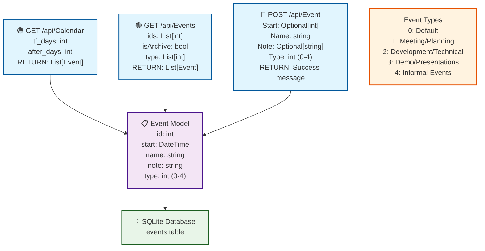

```mermaid
graph TD
    %% Event Model
    Event["📋 Event Model<br/>id: int<br/>start: DateTime<br/>name: string<br/>note: string<br/>type: int (0-4)"]
    
    %% API Endpoints
    Calendar["🟢 GET /api/Calendar<br/>tf_days: int<br/>after_days: int<br/>RETURN: List[Event]"]
    
    Events["🟢 GET /api/Events<br/>ids: List[int]<br/>isArchive: bool<br/>type: List[int]<br/>RETURN: List[Event]"]
    
    CreateEvent["🔴 POST /api/Event<br/>Start: Optional[int]<br/>Name: string<br/>Note: Optional[string]<br/>Type: int (0-4)<br/>RETURN: Success message"]
    
    %% Database
    DB["🗄️ SQLite Database<br/>events table"]
    
    %% Type Legend
    Types["Event Types<br/>0: Default<br/>1: Meeting/Planning<br/>2: Development/Technical<br/>3: Demo/Presentations<br/>4: Informal Events"]
    
    %% Connections
    Calendar --> Event
    Events --> Event
    CreateEvent --> Event
    Event --> DB
    
    %% Styling
    classDef endpoint fill:#e1f5fe,stroke:#01579b,stroke-width:2px
    classDef model fill:#f3e5f5,stroke:#4a148c,stroke-width:2px
    classDef database fill:#e8f5e8,stroke:#1b5e20,stroke-width:2px
    classDef legend fill:#fff3e0,stroke:#e65100,stroke-width:2px
    
    class Calendar,Events,CreateEvent endpoint
    class Event model
    class DB database
    class Types legend
```